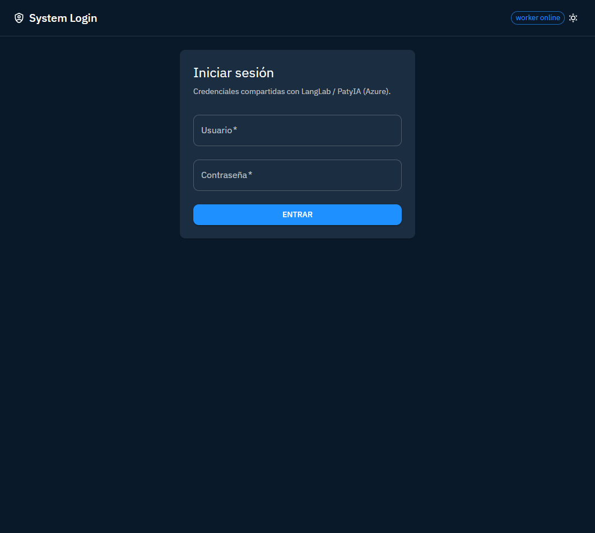

<p align="center">
  
</p>

<h1 align="center">system-login-front</h1>

<p align="center"><strong>Autenticación centralizada</strong> — login, sesión, permisos y catálogo de servicios Jeff-Aporta / PatyIA.</p>

[](https://jeff-aporta.github.io/system-login-front/)
[](https://react.dev/)
[](https://www.typescriptlang.org/)
[](https://mui.com/)

## Demo

**https://jeff-aporta.github.io/system-login-front/**

## Vista previa



## Qué hace

- **Login / logout** con credenciales del laboratorio
- **Dashboard de sesión**: usuario, rol, expiración del token
- **Permisos**: reglas del rol y excepciones por usuario
- **Penalización**: intentos fallidos y bloqueo temporal
- **Servicios**: listado de apps del ecosistema con enlace directo
- **Tema** claro/oscuro y modo local o producción

Icono: `mdi:shield-key-outline` · tema `#5e35b1`

## Vista local

```bash
npx serve .
```

MIT · [Jeff-Aporta](https://github.com/Jeff-Aporta)
